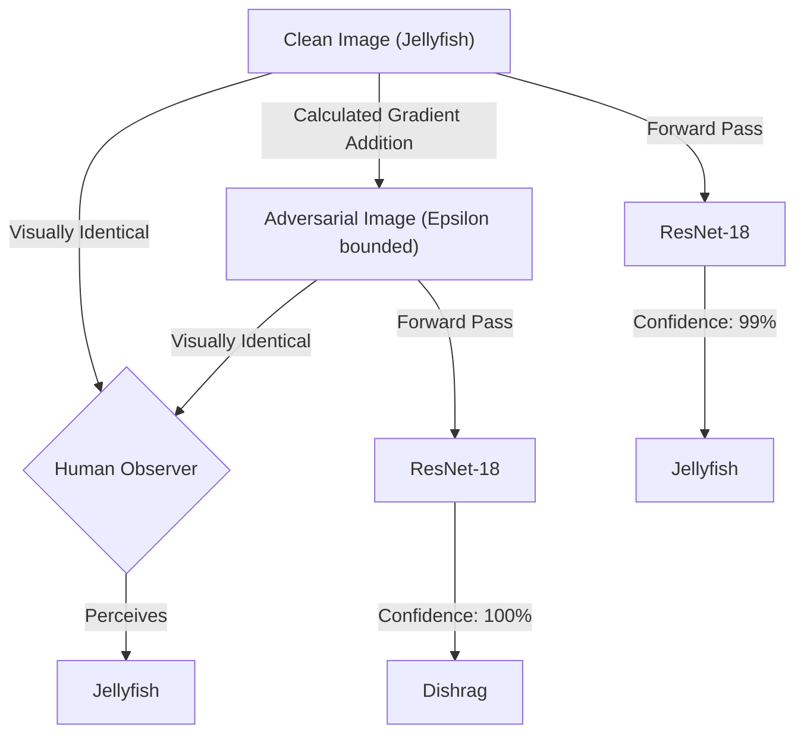
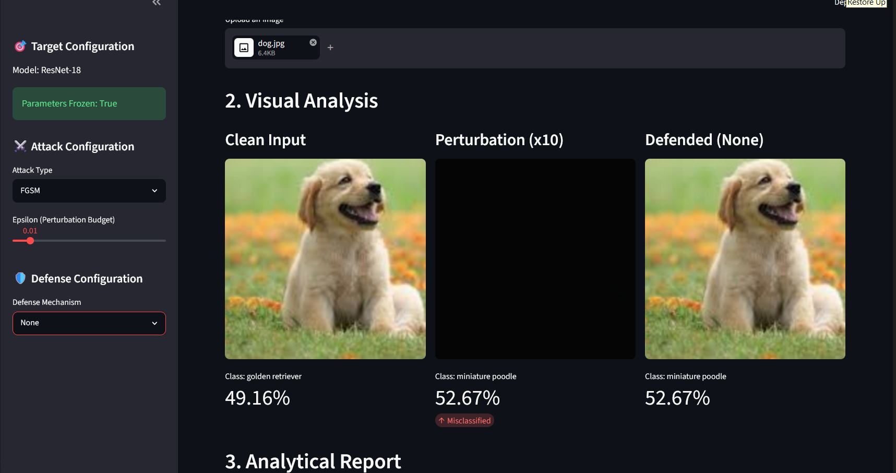
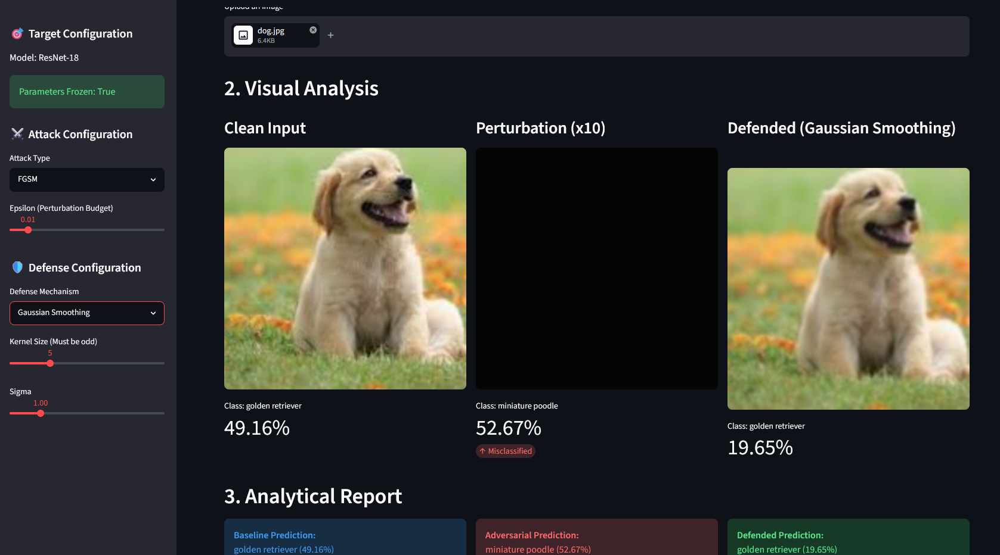
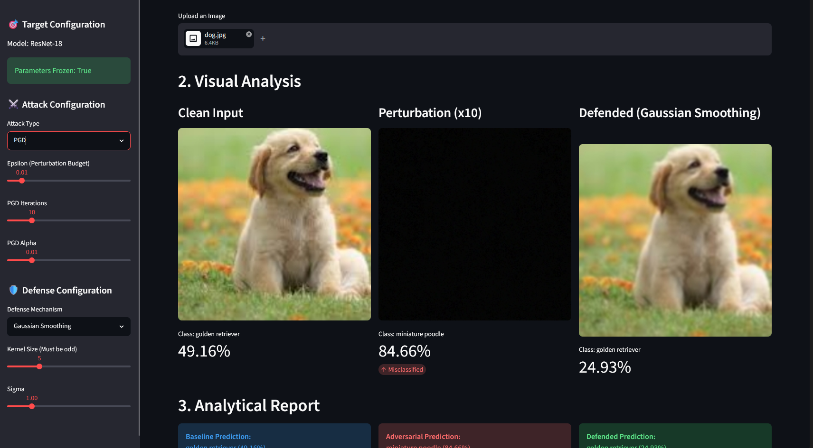

# 🛡️ VisionShield AI

VisionShield AI is an interactive, portfolio-grade Red Teaming and Defense evaluation suite. It is designed to test Convolutional Neural Networks (specifically a pre-trained ResNet-18) against white-box adversarial perturbations and demonstrate defensive preprocessing mitigations to restore model integrity.

## 🧠 Project Overview

Modern deep learning systems are highly susceptible to **Adversarial Attacks**—subtle, mathematically calculated perturbations added to inputs that are imperceptible to the human eye but cause catastrophic misclassification by the AI. VisionShield AI exposes these vulnerabilities and provides an interactive playground to test defensive strategies.

### What We Built
- **Target Model Integration**: A fully mapped ResNet-18 pipeline locking parameters (`requires_grad=False`) for clean evaluation.
- **Offensive Pipeline (Red Teaming)**: Implementation of core mathematical exploits including the Fast Gradient Sign Method (FGSM) and Projected Gradient Descent (PGD).
- **Defensive Engineering**: Preprocessing countermeasures including Gaussian Smoothing and Bit-Depth Reduction (Quantization) to strip out high-frequency adversarial noise.
- **Interactive UI**: A Streamlit dashboard to visually analyze the shifting confidence dynamics between clean inputs, adversarial noise, and defended outcomes.

---

## ⚔️ Understanding White-Box Attacks

In a **White-Box Attack**, the adversary has full access to the target model's architecture, weights, and gradients. By performing a forward pass and calculating the loss with respect to the input pixels (rather than the weights), the attacker can calculate exactly how to adjust the input image to maximize the model's error.

### How it Affects AI Systems Invisibly
The perturbation is constrained by an **Epsilon** ($\epsilon$) budget, meaning the pixel changes are strictly bounded. To a human observer, the image looks entirely normal and uncorrupted. However, the model perceives these micro-adjustments as overwhelming evidence for an incorrect class.



### The Mathematical Exploits

#### 1. Fast Gradient Sign Method (FGSM)
FGSM is a single-step attack designed to be computationally fast rather than strictly optimal. It calculates the gradient of the loss function with respect to the input pixels, and then shifts every pixel by a small, fixed amount ($\epsilon$) in the direction that maximizes the loss.

The adversarial image $x_{adv}$ is calculated as:

$$
x_{adv} = x + \epsilon \cdot \text{sign}(\nabla_{x} J(\theta, x, y))
$$

Where:
* $x$: The original clean image.
* $y$: The true class label.
* $\theta$: The model's frozen parameters.
* $J(\theta, x, y)$: The loss function (e.g., Cross-Entropy Loss) used to train the network.
* $\nabla_{x} J$: The gradient of the loss with respect to the input $x$.
* $\epsilon$: The perturbation budget (maximum magnitude a pixel can change, keeping it invisible).
* $\text{sign}(\cdot)$: A function that returns $+1$ for positive gradients and $-1$ for negative gradients, ensuring we step exactly $\epsilon$ in the steepest direction of error.

#### 2. Projected Gradient Descent (PGD)
PGD is a much more powerful, iterative extension of FGSM. Instead of taking one large step of size $\epsilon$, PGD takes multiple smaller steps of size $\alpha$. After each step, the perturbed image is **projected** (clipped) back into the valid $\epsilon$-neighborhood of the original image, ensuring the total perturbation never exceeds our visual budget.

The adversarial image at iteration $t+1$ is calculated as:

$$
x_{t+1} = \Pi_{x+\mathcal{S}} \left( x_t + \alpha \cdot \text{sign}(\nabla_{x_t} J(\theta, x_t, y)) \right)
$$

Where:
* $x_0 = x$: The initial clean image.
* $t$: The current iteration step.
* $\alpha$: The small step size taken per iteration (where $\alpha < \epsilon$).
* $\Pi_{x+\mathcal{S}}(\cdot)$: The projection operator that clips the values to remain within the allowed $L_\infty$ norm bound $\epsilon$ around the original image $x$, while simultaneously clamping the raw pixel limits strictly between $[0, 1]$.

---

## 🛡️ How AI Engineers Should Prevent These Attacks

Relying purely on model architecture is often insufficient against white-box attacks. Engineers must adopt a **Defense-in-Depth** strategy:

1. **Adversarial Training**: The most robust defense involves generating adversarial examples during the training phase and explicitly teaching the model to classify them correctly. This smooths out the decision boundaries.
2. **Input Preprocessing (As used in VisionShield)**: 
   - **Spatial Smoothing**: Applying filters (like Gaussian Blur) averages out the high-frequency micro-perturbations injected by the attacker.
   - **Quantization (Bit-Depth Reduction)**: Reducing the precision of the pixel values breaks the continuous mathematical gradients attackers rely upon.
3. **Gradient Masking/Obfuscation**: Employing non-differentiable layers or stochasticity to make it mathematically impossible (or extremely difficult) for the attacker to calculate useful gradients. *Note: Advanced attackers can sometimes bypass this by training a substitute model.*
4. **Ensemble Defenses**: Using multiple models with different architectures. An attack optimized for one model's gradients may not successfully transfer to another.

---

## 🚀 Getting Started

### Prerequisites
- Python 3.8+
- PyTorch & Torchvision
- Streamlit

### Installation
```bash
git clone <your-repository-url>
cd VisionShield
pip install -r requirements.txt
```

### Running the Dashboard
```bash
streamlit run app.py
```
Upload an image or let the system generate a synthetic sample, tune your attack budgets in the sidebar, and evaluate how the defensive layers mitigate the exploits!

---

## 🖼️ Dashboard Overview & Testing

Below is a visual overview of VisionShield AI in action, demonstrating how the model gets exploited and subsequently defended using our built-in Streamlit UI.

### 1. The Undefended FGSM Attack

*In this test, a clean image of a Golden Retriever is uploaded. We apply the Fast Gradient Sign Method (FGSM) with an Epsilon of 0.01. The perturbation is invisible to the human eye, but it successfully fools the ResNet-18 model into misclassifying the dog as a "miniature poodle" with 52.67% confidence.*

### 2. Defending FGSM with Gaussian Smoothing

*By enabling the **Gaussian Smoothing** defense (Kernel Size: 5, Sigma: 1.00), the high-frequency adversarial noise is blurred out. The model successfully recovers the correct "Golden Retriever" classification (19.65%), stripping away the adversary's malicious gradient.*

> **The Trade-off:** The confidence dropped significantly from the original 49.16% down to 19.65%. Why? Because Gaussian smoothing acts as a low-pass filter. While it blurs out the malicious noise, it also blurs out legitimate, fine-grained textures in the image (like the sharp edges of the dog's fur or eyes) that the CNN relies on to make confident predictions. You are actively observing the "Accuracy vs. Robustness" trade-off.

### 3. Mitigating an Iterative PGD Attack

*Here we upgrade the attack to **Projected Gradient Descent (PGD)**—a much stronger, iterative attack that pushes the wrong "miniature poodle" confidence up to a staggering 84.66%. Despite the stronger attack, our Gaussian Smoothing defense still successfully smooths out the adversarial artifacts and restores the true "Golden Retriever" classification.*
